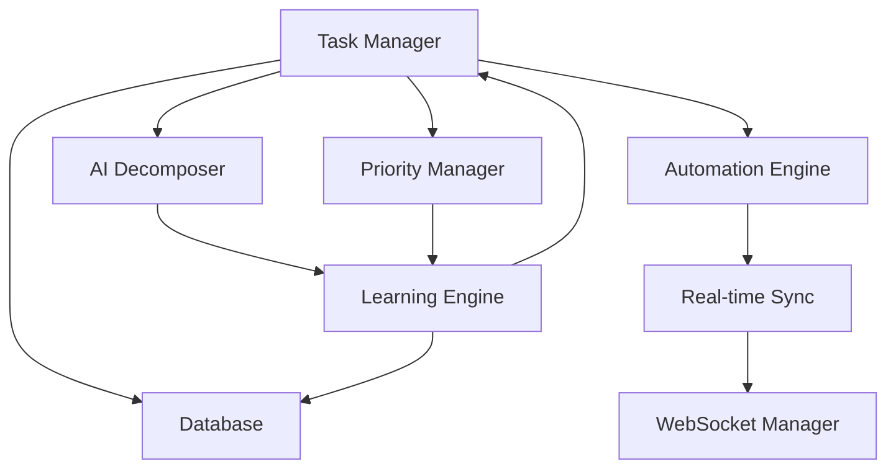
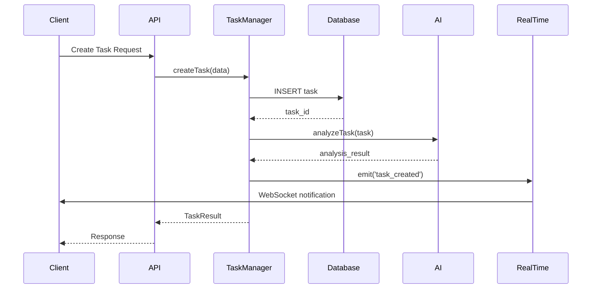
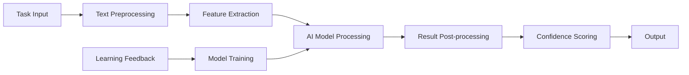

# Architecture Guide

Comprehensive system architecture documentation for the Intelligent Task Management System.

## Table of Contents

- [System Overview](#system-overview)
- [Architecture Principles](#architecture-principles)
- [Component Architecture](#component-architecture)
- [Data Architecture](#data-architecture)
- [API Architecture](#api-architecture)
- [Real-time Architecture](#real-time-architecture)
- [AI Integration Architecture](#ai-integration-architecture)
- [Security Architecture](#security-architecture)
- [Deployment Architecture](#deployment-architecture)
- [Scalability Considerations](#scalability-considerations)

## System Overview

The Intelligent Task Management System follows a modular, event-driven architecture designed for scalability, maintainability, and extensibility.

### High-Level Architecture

```
┌─────────────────────────────────────────────────────────────┐
│                    Client Applications                      │
│  ┌─────────────┐  ┌─────────────┐  ┌─────────────────────┐ │
│  │   Web UI    │  │  Mobile App │  │   Third-party Apps  │ │
│  └─────────────┘  └─────────────┘  └─────────────────────┘ │
└─────────────────────────────────────────────────────────────┘
                              │
                              ▼
┌─────────────────────────────────────────────────────────────┐
│                      API Gateway                           │
│  ┌─────────────────┐  ┌─────────────────────────────────┐  │
│  │   REST API      │  │      WebSocket Server           │  │
│  │   (Express.js)  │  │      (Socket.IO)                │  │
│  └─────────────────┘  └─────────────────────────────────┘  │
└─────────────────────────────────────────────────────────────┘
                              │
                              ▼
┌─────────────────────────────────────────────────────────────┐
│                   Business Logic Layer                     │
│  ┌─────────────┐ ┌─────────────┐ ┌─────────────────────────┐│
│  │Task Manager │ │AI Services  │ │   Automation Engine     ││
│  └─────────────┘ └─────────────┘ └─────────────────────────┘│
│  ┌─────────────┐ ┌─────────────┐ ┌─────────────────────────┐│
│  │Learning Sys │ │Priority Mgr │ │   Real-time Sync        ││
│  └─────────────┘ └─────────────┘ └─────────────────────────┘│
└─────────────────────────────────────────────────────────────┘
                              │
                              ▼
┌─────────────────────────────────────────────────────────────┐
│                     Data Layer                             │
│  ┌─────────────────┐  ┌─────────────────────────────────┐  │
│  │   SQLite DB     │  │      Vector Store               │  │
│  │   (Primary)     │  │      (AI Embeddings)            │  │
│  └─────────────────┘  └─────────────────────────────────┘  │
└─────────────────────────────────────────────────────────────┘
```

### Core Design Patterns

1. **Event-Driven Architecture** - Components communicate through events
2. **Dependency Injection** - Loose coupling between components
3. **Repository Pattern** - Data access abstraction
4. **Strategy Pattern** - Pluggable algorithms (AI, automation)
5. **Observer Pattern** - Real-time updates and notifications
6. **Command Pattern** - Task operations and automation actions

## Architecture Principles

### 1. Modularity
- **Single Responsibility**: Each component has one clear purpose
- **Loose Coupling**: Components interact through well-defined interfaces
- **High Cohesion**: Related functionality is grouped together

### 2. Scalability
- **Horizontal Scaling**: Components can be distributed across multiple instances
- **Vertical Scaling**: Efficient resource utilization
- **Caching**: Multiple levels of caching for performance

### 3. Extensibility
- **Plugin Architecture**: New features can be added without core changes
- **Configuration-Driven**: Behavior can be modified through configuration
- **API-First**: All functionality exposed through APIs

### 4. Reliability
- **Error Handling**: Comprehensive error handling and recovery
- **Graceful Degradation**: System continues to function with reduced capabilities
- **Circuit Breakers**: Protection against cascading failures

### 5. Security
- **Authentication**: Token-based authentication
- **Authorization**: Role-based access control
- **Data Protection**: Encryption at rest and in transit

## Component Architecture

### Core Components

#### 1. Task Hierarchy Engine
```typescript
┌─────────────────────────────────────┐
│         TaskHierarchyEngine         │
├─────────────────────────────────────┤
│ + createTask(data): TaskResult      │
│ + updateTask(id, data): TaskResult  │
│ + deleteTask(id): TaskResult        │
│ + getTask(id): Task                 │
│ + queryTasks(filters): Task[]       │
│ + addChild(parent, child): Result   │
│ + removeChild(parent, child): Result│
│ + validateHierarchy(): boolean      │
├─────────────────────────────────────┤
│ - tasks: Map<string, Task>          │
│ - hierarchy: TaskTree               │
│ - validator: TaskValidator          │
└─────────────────────────────────────┘
```

**Responsibilities:**
- Task CRUD operations
- Hierarchy management
- Data validation
- Relationship integrity

#### 2. AI Task Decomposer
```typescript
┌─────────────────────────────────────┐
│         AITaskDecomposer            │
├─────────────────────────────────────┤
│ + decomposeTask(id): DecompResult   │
│ + assessComplexity(task): Assessment│
│ + estimateEffort(task): Estimation  │
│ + generateSubtasks(task): Subtask[] │
├─────────────────────────────────────┤
│ - nlpProcessor: NLPProcessor        │
│ - complexityAnalyzer: Analyzer      │
│ - patternMatcher: PatternMatcher    │
│ - templateEngine: TemplateEngine    │
└─────────────────────────────────────┘
```

**Responsibilities:**
- Natural language processing
- Task complexity analysis
- Automatic subtask generation
- Pattern recognition

#### 3. Dynamic Priority Manager
```typescript
┌─────────────────────────────────────┐
│       DynamicPriorityManager        │
├─────────────────────────────────────┤
│ + calculatePriority(task): Score    │
│ + updatePriority(id, factors): void │
│ + getPriorityFactors(id): Factors   │
│ + bulkUpdatePriorities(): void      │
├─────────────────────────────────────┤
│ - scoringEngine: ScoringEngine      │
│ - factorWeights: WeightConfig       │
│ - dependencyAnalyzer: Analyzer      │
└─────────────────────────────────────┘
```

**Responsibilities:**
- Multi-factor priority calculation
- Real-time priority adjustment
- Dependency impact analysis
- Bulk priority operations

#### 4. Automation Engine
```typescript
┌─────────────────────────────────────┐
│          AutomationEngine           │
├─────────────────────────────────────┤
│ + executeRule(rule): ExecutionResult│
│ + processWorkflow(wf): WorkflowResult│
│ + scheduleTask(task): ScheduleResult│
│ + handleEvent(event): void          │
├─────────────────────────────────────┤
│ - ruleEngine: RuleEngine            │
│ - workflowManager: WorkflowManager  │
│ - scheduler: SchedulingService      │
│ - eventProcessor: EventProcessor    │
└─────────────────────────────────────┘
```

**Responsibilities:**
- Rule-based automation
- Workflow orchestration
- Event processing
- Task scheduling

### Component Interactions



## Data Architecture

### Database Schema

#### Core Tables

```sql
-- Tasks table
CREATE TABLE tasks (
    id TEXT PRIMARY KEY,
    title TEXT NOT NULL,
    description TEXT,
    type TEXT NOT NULL,
    status TEXT NOT NULL,
    priority TEXT NOT NULL,
    complexity TEXT,
    estimated_hours REAL,
    actual_hours REAL,
    progress INTEGER DEFAULT 0,
    parent_id TEXT,
    assignee TEXT,
    due_date DATETIME,
    created_at DATETIME DEFAULT CURRENT_TIMESTAMP,
    updated_at DATETIME DEFAULT CURRENT_TIMESTAMP,
    completed_at DATETIME,
    metadata JSON,
    FOREIGN KEY (parent_id) REFERENCES tasks(id)
);

-- Task dependencies
CREATE TABLE task_dependencies (
    id TEXT PRIMARY KEY,
    task_id TEXT NOT NULL,
    depends_on_id TEXT NOT NULL,
    dependency_type TEXT DEFAULT 'blocks',
    created_at DATETIME DEFAULT CURRENT_TIMESTAMP,
    FOREIGN KEY (task_id) REFERENCES tasks(id),
    FOREIGN KEY (depends_on_id) REFERENCES tasks(id)
);

-- Task tags
CREATE TABLE task_tags (
    task_id TEXT NOT NULL,
    tag TEXT NOT NULL,
    PRIMARY KEY (task_id, tag),
    FOREIGN KEY (task_id) REFERENCES tasks(id)
);

-- Learning data
CREATE TABLE learning_data (
    id TEXT PRIMARY KEY,
    task_id TEXT NOT NULL,
    feature_type TEXT NOT NULL,
    features JSON NOT NULL,
    actual_value REAL,
    predicted_value REAL,
    accuracy REAL,
    created_at DATETIME DEFAULT CURRENT_TIMESTAMP,
    FOREIGN KEY (task_id) REFERENCES tasks(id)
);

-- Automation rules
CREATE TABLE automation_rules (
    id TEXT PRIMARY KEY,
    name TEXT NOT NULL,
    description TEXT,
    trigger_config JSON NOT NULL,
    action_config JSON NOT NULL,
    is_active BOOLEAN DEFAULT true,
    execution_count INTEGER DEFAULT 0,
    success_count INTEGER DEFAULT 0,
    created_at DATETIME DEFAULT CURRENT_TIMESTAMP,
    updated_at DATETIME DEFAULT CURRENT_TIMESTAMP
);
```

#### Indexes for Performance

```sql
-- Task queries
CREATE INDEX idx_tasks_status ON tasks(status);
CREATE INDEX idx_tasks_priority ON tasks(priority);
CREATE INDEX idx_tasks_assignee ON tasks(assignee);
CREATE INDEX idx_tasks_due_date ON tasks(due_date);
CREATE INDEX idx_tasks_parent ON tasks(parent_id);
CREATE INDEX idx_tasks_created ON tasks(created_at);

-- Dependencies
CREATE INDEX idx_dependencies_task ON task_dependencies(task_id);
CREATE INDEX idx_dependencies_depends ON task_dependencies(depends_on_id);

-- Learning data
CREATE INDEX idx_learning_task ON learning_data(task_id);
CREATE INDEX idx_learning_type ON learning_data(feature_type);
CREATE INDEX idx_learning_created ON learning_data(created_at);
```

### Data Flow



## API Architecture

### RESTful API Design

#### Resource-Based URLs
```
/api/v1/tasks                    # Task collection
/api/v1/tasks/{id}              # Individual task
/api/v1/tasks/{id}/children     # Task children
/api/v1/tasks/{id}/dependencies # Task dependencies
/api/v1/ai/decompose/{id}       # AI decomposition
/api/v1/priority/{id}           # Priority management
/api/v1/automation/rules        # Automation rules
```

#### HTTP Methods
- **GET** - Retrieve resources
- **POST** - Create new resources
- **PUT** - Update entire resources
- **PATCH** - Partial updates
- **DELETE** - Remove resources

#### Response Format
```typescript
interface APIResponse<T> {
  success: boolean;
  data?: T;
  error?: {
    code: string;
    message: string;
    metadata?: any;
  };
  metadata: {
    timestamp: string;
    requestId: string;
    version: string;
  };
}
```

### Middleware Stack

```typescript
app.use(helmet());                    // Security headers
app.use(cors(corsOptions));          // CORS handling
app.use(compression());              // Response compression
app.use(express.json({ limit: '10mb' })); // JSON parsing
app.use(rateLimiter);                // Rate limiting
app.use(authMiddleware);             // Authentication
app.use(validationMiddleware);       // Request validation
app.use(loggingMiddleware);          // Request logging
app.use('/api/v1', apiRoutes);       // API routes
app.use(errorHandler);               // Error handling
```

## Real-time Architecture

### WebSocket Communication

```typescript
// Server-side WebSocket handling
io.on('connection', (socket) => {
  // Authentication
  socket.on('authenticate', async (token) => {
    const user = await authenticateToken(token);
    socket.userId = user.id;
    socket.join(`user:${user.id}`);
  });

  // Channel subscriptions
  socket.on('subscribe', (data) => {
    const { channel, filters } = data;
    socket.join(channel);
    
    // Apply filters for personalized updates
    socket.filters = filters;
  });

  // Task updates
  socket.on('task_update', async (data) => {
    const result = await taskManager.updateTask(data.id, data.updates);
    
    // Broadcast to relevant subscribers
    io.to('tasks').emit('task_updated', {
      taskId: data.id,
      updates: data.updates,
      timestamp: new Date().toISOString()
    });
  });
});
```

### Event Broadcasting Strategy

```typescript
class RealTimeEventManager {
  private io: SocketIO.Server;
  private channels: Map<string, Set<string>> = new Map();

  broadcastTaskEvent(event: TaskEvent): void {
    const channels = this.getRelevantChannels(event);
    
    channels.forEach(channel => {
      this.io.to(channel).emit(event.type, {
        ...event.data,
        timestamp: new Date().toISOString()
      });
    });
  }

  private getRelevantChannels(event: TaskEvent): string[] {
    const channels = ['tasks']; // Global task channel
    
    if (event.taskId) {
      channels.push(`task:${event.taskId}`);
    }
    
    if (event.assignee) {
      channels.push(`user:${event.assignee}`);
    }
    
    if (event.projectId) {
      channels.push(`project:${event.projectId}`);
    }
    
    return channels;
  }
}
```

## AI Integration Architecture

### AI Service Abstraction

```typescript
interface AIProvider {
  name: string;
  capabilities: AICapability[];
  
  analyzeText(text: string): Promise<TextAnalysis>;
  generateEmbedding(text: string): Promise<number[]>;
  classifyTask(task: Task): Promise<Classification>;
  estimateComplexity(task: Task): Promise<ComplexityEstimate>;
}

class OpenAIProvider implements AIProvider {
  name = 'openai';
  capabilities = ['text_analysis', 'embedding', 'classification'];
  
  async analyzeText(text: string): Promise<TextAnalysis> {
    const response = await this.client.createCompletion({
      model: 'gpt-4',
      prompt: `Analyze this task description: ${text}`,
      max_tokens: 500
    });
    
    return this.parseAnalysis(response.data.choices[0].text);
  }
}
```

### AI Pipeline Architecture



### Learning System Architecture

```typescript
class AdaptiveLearningEngine {
  private models: Map<string, MLModel> = new Map();
  private trainingQueue: TrainingData[] = [];
  
  async learn(taskId: string, actualOutcome: any): Promise<void> {
    // Collect training data
    const features = await this.extractFeatures(taskId);
    const trainingData = { features, outcome: actualOutcome };
    
    this.trainingQueue.push(trainingData);
    
    // Trigger retraining if enough data
    if (this.trainingQueue.length >= this.config.batchSize) {
      await this.retrain();
    }
  }
  
  private async retrain(): Promise<void> {
    const data = this.trainingQueue.splice(0);
    
    for (const [modelName, model] of this.models) {
      await model.train(data);
      await this.validateModel(model);
    }
  }
}
```

## Security Architecture

### Authentication & Authorization

```typescript
// JWT-based authentication
interface AuthToken {
  userId: string;
  roles: string[];
  permissions: string[];
  exp: number;
  iat: number;
}

class AuthService {
  generateToken(user: User): string {
    const payload: AuthToken = {
      userId: user.id,
      roles: user.roles,
      permissions: this.getUserPermissions(user),
      exp: Math.floor(Date.now() / 1000) + (24 * 60 * 60), // 24 hours
      iat: Math.floor(Date.now() / 1000)
    };
    
    return jwt.sign(payload, process.env.JWT_SECRET!);
  }
  
  verifyToken(token: string): AuthToken {
    return jwt.verify(token, process.env.JWT_SECRET!) as AuthToken;
  }
}
```

### Role-Based Access Control

```typescript
enum Permission {
  READ_TASKS = 'read:tasks',
  WRITE_TASKS = 'write:tasks',
  DELETE_TASKS = 'delete:tasks',
  MANAGE_AUTOMATION = 'manage:automation',
  VIEW_ANALYTICS = 'view:analytics'
}

class AuthorizationService {
  hasPermission(user: AuthToken, permission: Permission): boolean {
    return user.permissions.includes(permission);
  }
  
  canAccessTask(user: AuthToken, task: Task): boolean {
    // Task owner can always access
    if (task.assignee === user.userId) return true;
    
    // Check role-based access
    if (user.roles.includes('admin')) return true;
    if (user.roles.includes('manager') && task.type !== 'confidential') return true;
    
    return false;
  }
}
```

### Data Protection

```typescript
// Encryption for sensitive data
class EncryptionService {
  private algorithm = 'aes-256-gcm';
  private key = crypto.scryptSync(process.env.ENCRYPTION_KEY!, 'salt', 32);
  
  encrypt(text: string): EncryptedData {
    const iv = crypto.randomBytes(16);
    const cipher = crypto.createCipher(this.algorithm, this.key);
    cipher.setAAD(Buffer.from('task-management', 'utf8'));
    
    let encrypted = cipher.update(text, 'utf8', 'hex');
    encrypted += cipher.final('hex');
    
    const authTag = cipher.getAuthTag();
    
    return {
      encrypted,
      iv: iv.toString('hex'),
      authTag: authTag.toString('hex')
    };
  }
  
  decrypt(data: EncryptedData): string {
    const decipher = crypto.createDecipher(this.algorithm, this.key);
    decipher.setAAD(Buffer.from('task-management', 'utf8'));
    decipher.setAuthTag(Buffer.from(data.authTag, 'hex'));
    
    let decrypted = decipher.update(data.encrypted, 'hex', 'utf8');
    decrypted += decipher.final('utf8');
    
    return decrypted;
  }
}
```

## Deployment Architecture

### Container Architecture

```dockerfile
# Multi-stage build
FROM node:18-alpine AS builder
WORKDIR /app
COPY package*.json ./
RUN npm ci --only=production

FROM node:18-alpine AS runtime
WORKDIR /app
COPY --from=builder /app/node_modules ./node_modules
COPY dist ./dist
COPY config ./config

EXPOSE 3000
CMD ["node", "dist/index.js"]
```

### Docker Compose Setup

```yaml
version: '3.8'
services:
  app:
    build: .
    ports:
      - "3000:3000"
    environment:
      - NODE_ENV=production
      - DATABASE_PATH=/data/tasks.db
    volumes:
      - task_data:/data
    depends_on:
      - redis
      
  redis:
    image: redis:7-alpine
    ports:
      - "6379:6379"
    volumes:
      - redis_data:/data
      
  nginx:
    image: nginx:alpine
    ports:
      - "80:80"
      - "443:443"
    volumes:
      - ./nginx.conf:/etc/nginx/nginx.conf
      - ./ssl:/etc/nginx/ssl
    depends_on:
      - app

volumes:
  task_data:
  redis_data:
```

### Kubernetes Deployment

```yaml
apiVersion: apps/v1
kind: Deployment
metadata:
  name: task-management-app
spec:
  replicas: 3
  selector:
    matchLabels:
      app: task-management
  template:
    metadata:
      labels:
        app: task-management
    spec:
      containers:
      - name: app
        image: task-management:latest
        ports:
        - containerPort: 3000
        env:
        - name: NODE_ENV
          value: "production"
        - name: DATABASE_PATH
          value: "/data/tasks.db"
        resources:
          requests:
            memory: "256Mi"
            cpu: "250m"
          limits:
            memory: "512Mi"
            cpu: "500m"
        livenessProbe:
          httpGet:
            path: /health
            port: 3000
          initialDelaySeconds: 30
          periodSeconds: 10
        readinessProbe:
          httpGet:
            path: /ready
            port: 3000
          initialDelaySeconds: 5
          periodSeconds: 5
```

## Scalability Considerations

### Horizontal Scaling

1. **Stateless Services**: All services are stateless for easy scaling
2. **Load Balancing**: Distribute requests across multiple instances
3. **Database Sharding**: Partition data across multiple databases
4. **Caching**: Multiple levels of caching (Redis, in-memory)

### Performance Optimization

1. **Database Optimization**:
   - Proper indexing strategy
   - Query optimization
   - Connection pooling
   - Read replicas

2. **Caching Strategy**:
   ```typescript
   class CacheManager {
     private redis: Redis;
     private memoryCache: Map<string, any> = new Map();
     
     async get(key: string): Promise<any> {
       // L1: Memory cache
       if (this.memoryCache.has(key)) {
         return this.memoryCache.get(key);
       }
       
       // L2: Redis cache
       const cached = await this.redis.get(key);
       if (cached) {
         const data = JSON.parse(cached);
         this.memoryCache.set(key, data);
         return data;
       }
       
       return null;
     }
   }
   ```

3. **Async Processing**:
   ```typescript
   class TaskQueue {
     private queue: Queue;
     
     async addJob(type: string, data: any): Promise<void> {
       await this.queue.add(type, data, {
         attempts: 3,
         backoff: 'exponential',
         delay: 1000
       });
     }
     
     process(type: string, processor: (job: Job) => Promise<void>): void {
       this.queue.process(type, 5, processor); // 5 concurrent jobs
     }
   }
   ```

### Monitoring & Observability

```typescript
class MetricsCollector {
  private prometheus: PrometheusRegistry;
  
  constructor() {
    this.setupMetrics();
  }
  
  private setupMetrics(): void {
    // Request duration histogram
    this.requestDuration = new prometheus.Histogram({
      name: 'http_request_duration_seconds',
      help: 'Duration of HTTP requests in seconds',
      labelNames: ['method', 'route', 'status_code']
    });
    
    // Task operation counter
    this.taskOperations = new prometheus.Counter({
      name: 'task_operations_total',
      help: 'Total number of task operations',
      labelNames: ['operation', 'status']
    });
  }
  
  recordRequest(method: string, route: string, status: number, duration: number): void {
    this.requestDuration
      .labels(method, route, status.toString())
      .observe(duration);
  }
}
```

---

This architecture provides a solid foundation for a scalable, maintainable, and extensible intelligent task management system. The modular design allows for easy testing, deployment, and future enhancements. 