# 🧠 Self-Improvement Agent Integration Complete!

## ✨ What We Built

You now have a **complete self-improving AI agent ecosystem** integrated into your Agentic Coding Framework. The AI agents will **automatically detect and improve framework files** while working with users, creating a continuously evolving and optimizing system.

## 🎯 Core Features Implemented

### 1. **Interactive Self-Improvement Agent** (`scripts/self_improvement_agent.js`)
- **Context-aware analysis** - only analyzes files when needed
- **Smart detection** - finds relevant files based on current work context  
- **Interactive commands** - `analyze`, `improve`, `context`, `smart-detect`
- **Priority-based improvements** - High/Medium/Low with appropriate actions
- **Learning capabilities** - adapts based on user feedback patterns

### 2. **AutoPilot Integration** (Updated `01_AutoPilot.mdc`)
- **Rule 1.5: Self-Improvement Integration** added to Core Operational Rules
- **Automatic analysis triggers** during workflow phases
- **Smart improvement detection** for current project context
- **Non-disruptive enhancement** with user approval workflow
- **Learning integration** to adapt suggestions over time

### 3. **Quick Reference Guide** (`Quick_Self_Improvement_Reference.mdc`)
- **Decision matrix** for when to analyze files
- **Priority levels** and appropriate actions
- **Communication templates** for presenting improvements
- **Success metrics** for tracking framework evolution

## 🚀 How It Works During AI-User Workflows

### **Phase-by-Phase Integration**

```mermaid
graph TD
    A[AI Agent Starts AutoPilot] --> B[Read Workflow File]
    B --> C[🔍 Pre-Analysis Check]
    C --> D{Critical Issues?}
    D -->|Yes| E[🚨 Pause & Present Fix]
    D -->|No| F[Execute Phase]
    F --> G[Generate Documents]
    G --> H[📊 Post-Analysis]
    H --> I{Medium Priority Issues?}
    I -->|Yes| J[📝 Note for Review]
    I -->|No| K[Continue to Next Phase]
    E --> L[User Approves?]
    L -->|Yes| M[Apply Improvement]
    L -->|No| N[🧠 Learn Preference]
    M --> F
    N --> F
```



### **Smart Detection Triggers**

1. **Before Using Workflow Files**:
   - Outdated technology references for current `projectType`
   - Missing examples that would help users
   - Unclear instructions causing confusion

2. **After Generating Documents**:
   - Template improvements based on project learnings
   - Gaps in templates for specific project types
   - Additional sections that would benefit future projects

3. **During User Interactions**:
   - User confusion indicating framework gaps
   - Workflow inefficiencies
   - Repeated user questions

## 🎯 Priority System & Actions

| Priority | Examples | Action |
|----------|----------|--------|
| **🚨 High** | Security gaps, broken logic, missing critical examples | **Pause workflow**, present fix, await approval |
| **⚠️ Medium** | Tech updates (React 16→18), template enhancements | **Note for end-of-phase review** |
| **ℹ️ Low** | Documentation formatting, minor inconsistencies | **Log silently** for post-project optimization |

## 🧠 Learning & Adaptation

### **User Preference Tracking**
```javascript
userPreferences = {
  "prefers_detailed_examples": true,
  "technology_comfort_level": "intermediate",
  "workflow_pace": "thorough", 
  "improvement_notification_level": "medium"
}
```

### **Adaptation Patterns**
- User approves tech updates → Suggest similar updates proactively
- User prefers minimal interruptions → Lower notification threshold  
- User asks for more examples → Prioritize example-related improvements

## 🛠️ Usage Commands

### **Interactive Mode**
```bash
# Start the self-improvement agent
npm run improve

# Available commands:
🤖 > analyze <filename>     # Analyze specific .mdc file
🤖 > improve <filename>     # Get improvement suggestions  
🤖 > context <topic>        # Set current work context
🤖 > smart-detect           # Analyze based on context
🤖 > help                   # Show available commands
🤖 > exit                   # Stop the agent
```

### **Demo Mode**
```bash
# See the agent in action
npm run demo-agent
```

## 📊 Success Metrics

### **Framework Quality Indicators**
- ✅ Reduced user clarification questions per phase
- ✅ Increased workflow completion rate without interruptions
- ✅ Higher user satisfaction with generated templates
- ✅ Fewer repetitive issues across projects

### **Learning Effectiveness**  
- ✅ Improvement suggestion acceptance rate by priority
- ✅ Time saved through proactive improvements
- ✅ User workflow efficiency improvement over time

## 🎉 What This Means for Your Framework

### **For Users:**
- **Smoother workflows** with fewer outdated instructions
- **Better examples** and clearer guidance automatically added
- **Personalized experience** that adapts to their preferences
- **Faster development** with optimized templates and workflows

### **For the Framework:**
- **Self-evolving codebase** that improves with each project
- **Real-time updates** to keep pace with technology changes
- **Data-driven improvements** based on actual user patterns
- **Reduced maintenance overhead** through automated optimization

### **For AI Agents:**
- **Context-aware assistance** during workflow execution
- **Proactive improvement suggestions** at optimal moments
- **Learning from user feedback** to provide better assistance
- **Continuous framework enhancement** without manual intervention

## 🔄 The Self-Improvement Loop

```
📊 Detect Issues → 🎯 Analyze Context → 💡 Generate Solutions → 
👤 Get User Feedback → 🧠 Learn Preferences → 📈 Adapt Behavior → 
🔄 Improve Framework → 📊 Detect Issues...
```

## 🚀 Next Steps

1. **Test with Real Projects**: Use the AutoPilot workflow and observe improvements
2. **Monitor Learning**: Track which suggestions users accept/reject
3. **Expand Detection**: Add more sophisticated pattern recognition
4. **Build Analytics**: Create dashboards to visualize framework evolution
5. **Community Integration**: Share improvement patterns across teams

---

**🎯 Result**: You now have a **truly intelligent, self-improving coding framework** that gets better with every project, learns from every interaction, and continuously evolves to provide the best possible developer experience! 